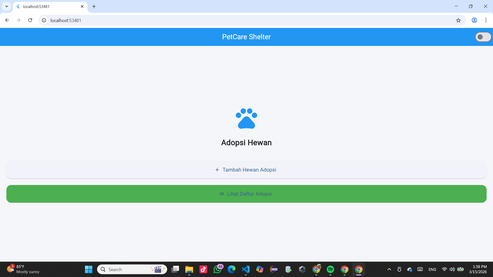
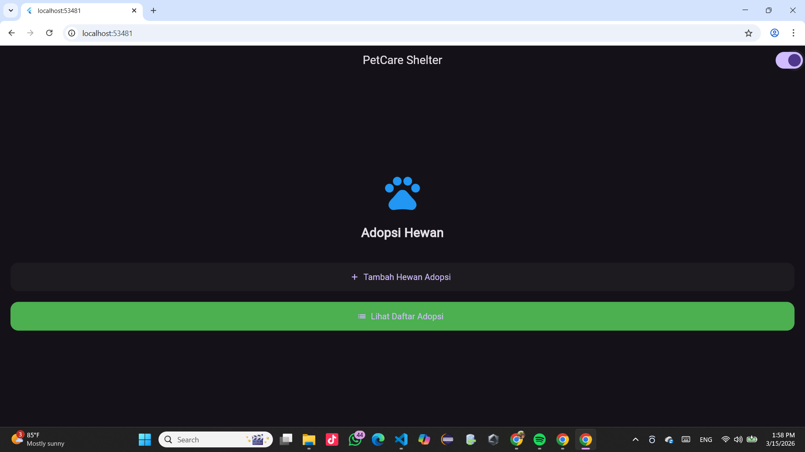
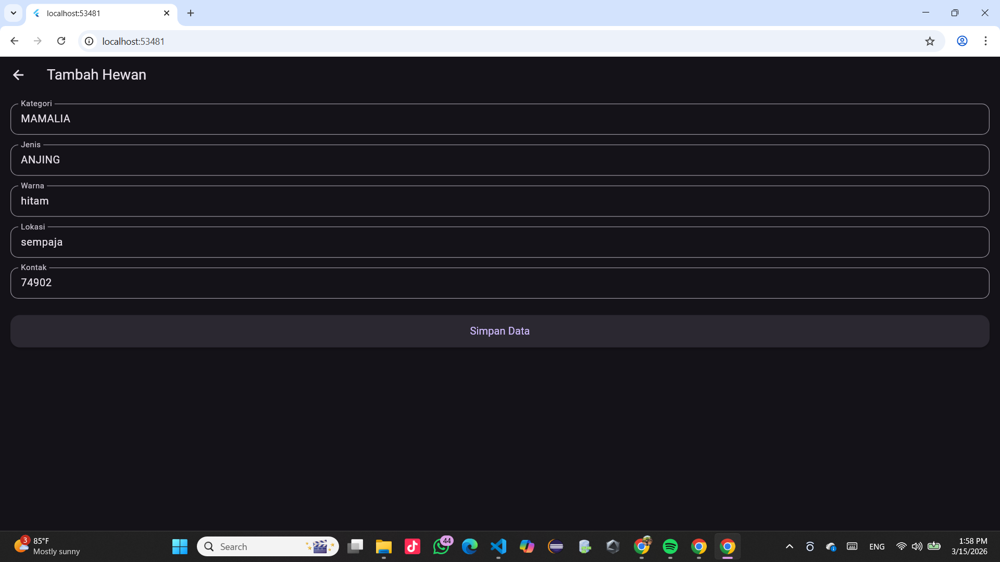
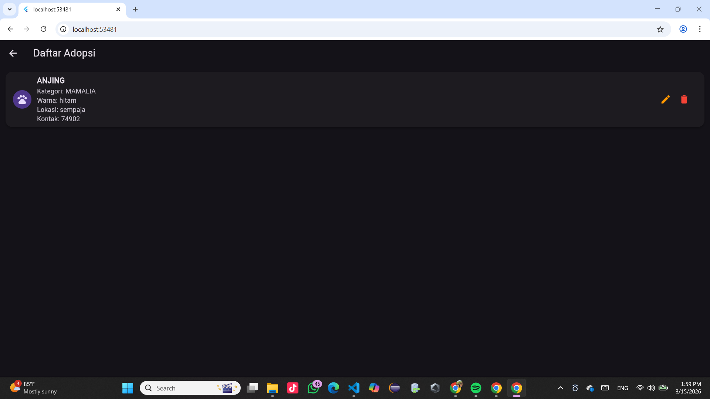
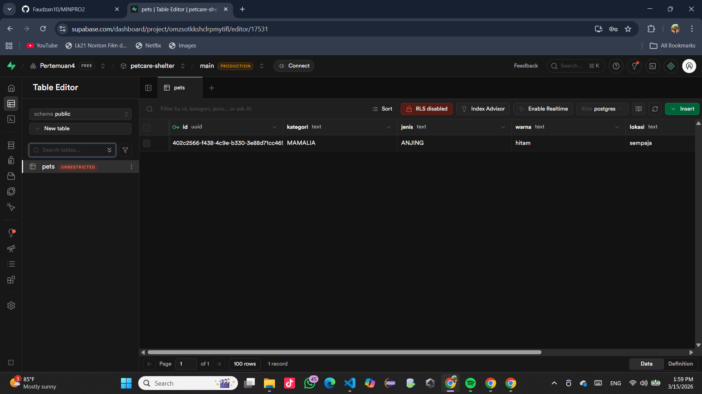
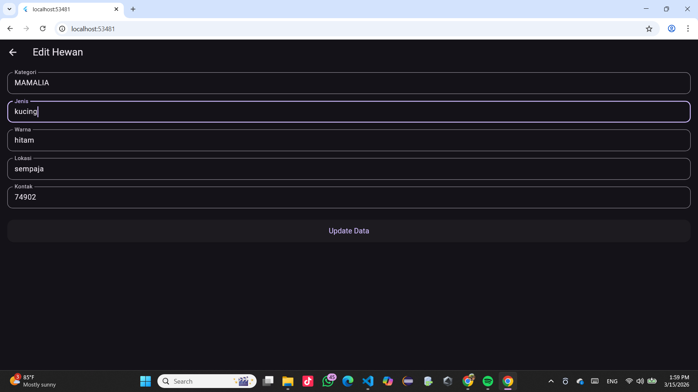
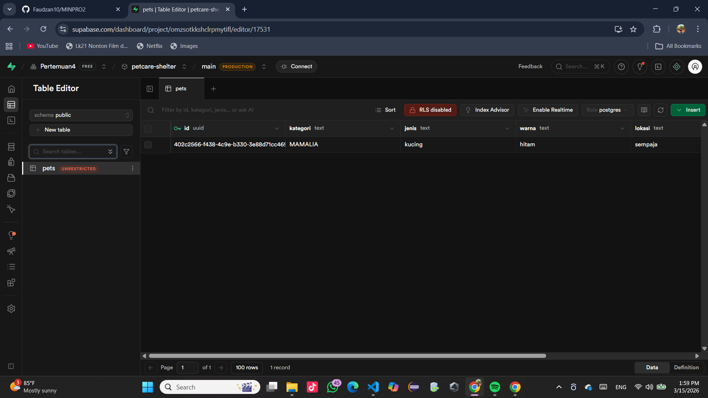
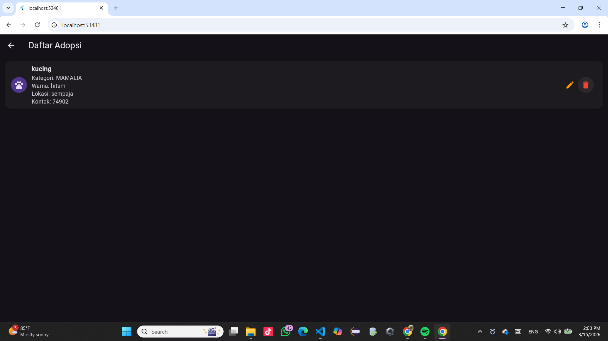
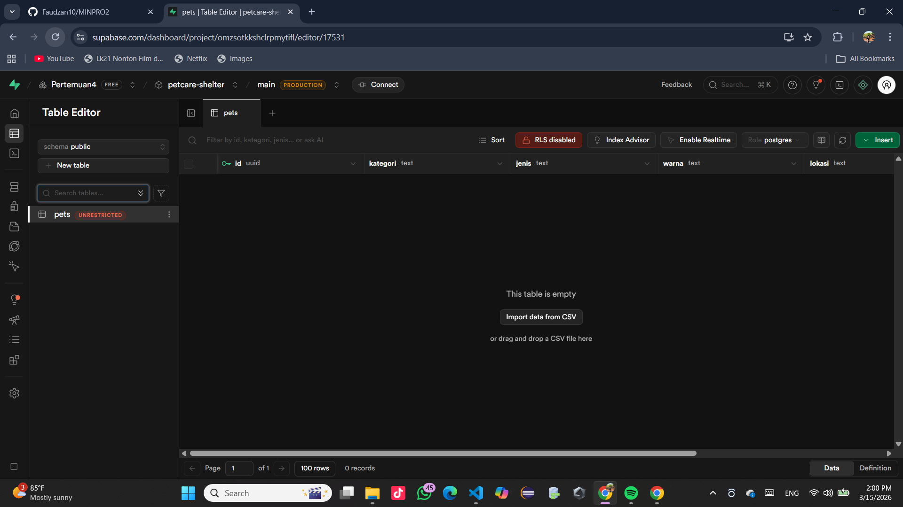
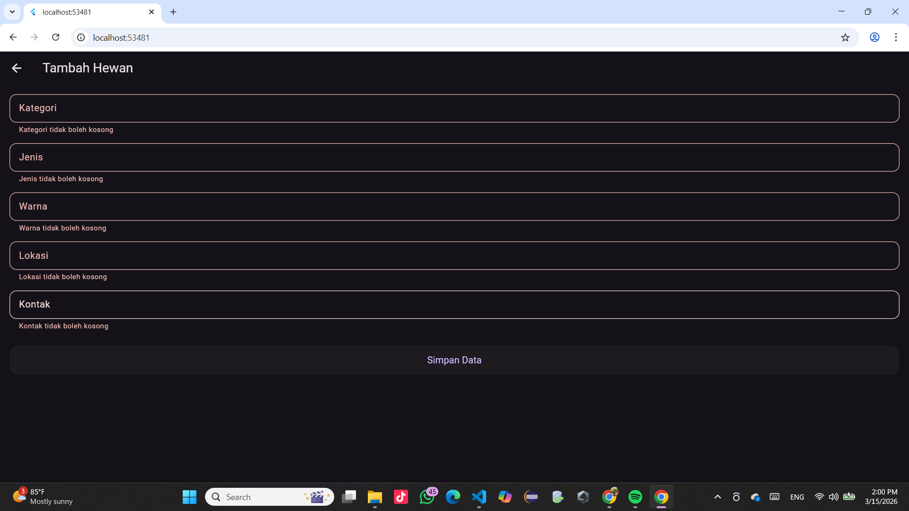

# Mini Project 2 - PetCare Shelter

**Nama:** Muhammad Irdhan Nur Faudzan  
**NIM:** 2409116077  

---

## Deskripsi Aplikasi

PetCare Shelter adalah aplikasi mobile yang dibuat menggunakan **Flutter** dan terintegrasi dengan **Supabase** sebagai database.  

Aplikasi ini digunakan untuk mengelola data hewan yang tersedia untuk **adopsi di shelter**. Pengguna dapat menambahkan data hewan, melihat daftar hewan yang tersedia, mengedit data hewan, serta menghapus data hewan dari database.  

Data yang dimasukkan pada aplikasi akan langsung tersimpan di **Supabase Database** sehingga data dapat dikelola secara online.

---

## Fitur Aplikasi

Aplikasi ini memiliki beberapa fitur utama yaitu:

- **Create**  
  Menambahkan data hewan adopsi ke database Supabase.

- **Read**  
  Menampilkan daftar hewan yang tersedia untuk diadopsi dari database Supabase.

- **Update**  
  Mengedit informasi data hewan yang sudah ada.

- **Delete**  
  Menghapus data hewan dari database.

- **Navigasi Halaman**  
  Aplikasi memiliki beberapa halaman seperti:
  - Halaman Home
  - Halaman Form Tambah / Edit Data
  - Halaman List Data

- **Dark Mode dan Light Mode**  
  Aplikasi dapat mengganti tampilan antara mode terang dan mode gelap menggunakan switch.

---

## Widget yang Digunakan

Beberapa widget Flutter yang digunakan dalam aplikasi ini antara lain:

- MaterialApp
- Scaffold
- AppBar
- Switch
- Center
- Padding
- Column
- Row
- Icon
- ElevatedButton
- ElevatedButton.icon
- ListView
- ListView.builder
- Card
- ListTile
- CircleAvatar
- Text
- TextFormField
- Form
- GlobalKey
- Navigator
- SizedBox

==========================================================================================

## ALUR PROGRAM

Berikut adalah alur penggunaan aplikasi **PetCare Shelter** dari awal hingga pengelolaan data hewan adopsi.

---

### 1. Tampilan Awal (Light Mode)

Saat aplikasi dibuka, pengguna akan melihat halaman utama aplikasi dengan tampilan **mode terang**.

---

### 2. Tampilan Awal (Dark Mode)

Pengguna dapat mengganti tampilan aplikasi menjadi **mode gelap** menggunakan tombol switch pada bagian atas aplikasi.

---

### 3. Menambahkan Data Hewan

Pengguna dapat menambahkan data hewan yang akan diadopsi melalui halaman form input.

---

### 4. Melihat Daftar Hewan

Setelah data disimpan, pengguna dapat melihat daftar hewan yang tersedia untuk diadopsi.

---

### 5. Data Tersimpan di Supabase

Data yang dimasukkan pada aplikasi akan tersimpan pada **database Supabase**.

---

### 6. Mengupdate Data Hewan

Pengguna dapat mengedit atau memperbarui data hewan yang sudah tersimpan.

---

### 7. Update Data di Supabase

Perubahan data pada aplikasi akan langsung diperbarui pada database Supabase.

---

### 8. Menghapus Data Hewan

Pengguna juga dapat menghapus data hewan yang sudah tidak tersedia untuk diadopsi.

---

### 9. Data Terhapus di Supabase

Setelah dihapus, data tersebut juga akan terhapus dari database Supabase.

---

### 10. Validasi Input

Jika pengguna mencoba menyimpan data dengan form kosong, aplikasi akan menampilkan peringatan validasi.

